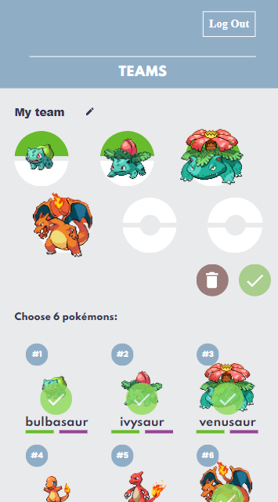
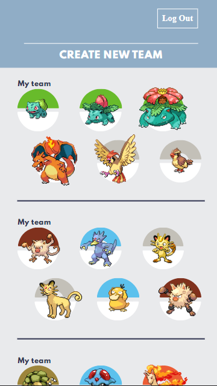

<h1 align="center">Team builder Pokemon</h1>
<p align="center">
Faça seu equipe pokemon
</p>
<div align="center">
  
  <br>
  
</div>

<hr>

### Deploy

Você pode acessar por aqui [here](https://pokemon-team-builder-ashen.vercel.app/)

<hr>

### 📦 Instalação
Depois de você clonar o projeto, você pode:
<h3>NPM </h3>

```bash
npm install
npm start
```

<h3>Yarn</h3>

```bash
yarn
yarn start
```
<hr>

### 🛠 Tecnologia
 
 - [Node.js](https://nodejs.org/en/)
 - [React](https://pt-br.reactjs.org/)
- [SASS](https://sass-lang.com/)

<hr>

### 👨🏾‍💻 Autor
<a href="https://github.com/HuberthVladimir">
 
 <br />
 <sub style="margin-bottom: 3px;"><b>Huberth Vladimir</b></sub></a>
 
 [](https://www.linkedin.com/in/huberth-vladimir/) 
